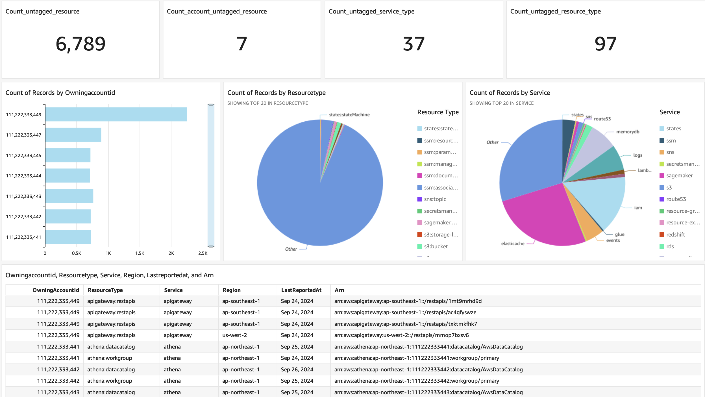

## Introduction

This repository provides a sample solution for finding both untagged and tagged resource acorss accounts by using AWS Resouce Explorer (ARE). It also automoate deploying a QuickSight dashboard for visualzing found resources. CloudFormation templates are provide for deploying:

- A Lambda function calling ARE to list all untagged and tagged resources
- A QuickSight dataset
- A QuickSight analysis



## Prerequisite

Before deploy this solution, you need to setup AWS Resource Explorer in the management account or a delegated administration account, and turn on multi-account search.

1. [Setting up and configuring Resource Explorer](https://docs.aws.amazon.com/resource-explorer/latest/userguide/getting-started-setting-up.html)

2. [Turning on multi-account search](https://docs.aws.amazon.com/resource-explorer/latest/userguide/manage-service-multi-account.html)

3. Already setup a S3 bucket for saving QuickSight manifest.json and found results from the Lambda function.

4. Already setup a QuickSight account and an user.

## Deployment

Below is the project structure:

```python
|--template
   |--cf-analysis.yaml
   |--cf-dataset.yaml
   |--cf-lambda.yaml
|--README.md
```

Step 1. Deploy the Lambda function

```bash
aws cloudformation create-stack \
 --stack-name lambda-aws-resource-explorer-stack \
 --template-body file://cf-lambda.yaml \
 --parameters '[{"ParameterKey": "LambdaLayerArn", "ParameterValue": "<YOUR_LAMBDA_LAYER_ARN>"},{"ParameterKey":"S3BucketName","ParameterValue":"<YOUR_S3_BUCKET_NAME>"},{"ParameterKey":"AREViewArn","ParameterValue":"<YOUR_ARE_VIEW_ARN>"}]' \
 --capabilities CAPABILITY_NAMED_IAM
```

**IMPORTANT**: _The resouce-explorer-2 client is not supported in boto3 and botocore 1.34.X and older version, so you need to add a Lambda layer with boto3 and botocore 1.35.29 or later. If AWS Lamdbda already use boto3 and botocore 1.35.29 or later, then you can skip setting the Lambda layer and YOUR_LAMBDA_LAYER_ARN._

Step 3. Create a QuickSight dataset

```bash
aws cloudformation create-stack \
  --stack-name cfn-dataset \
  --template-body file://cf-dataset.yaml \
  --parameters '[{"ParameterKey": "QuickSightUserArn","ParameterValue": "<YOUR_QUICKSIGHT_USER_ARN>"},{"ParameterKey":"S3BucketName","ParameterValue":"<YOUR_S3_BUCKET>"},{"ParameterKey":"S3KeyName","ParameterValue":"quicksight/manifest.json"},{"ParameterKey":"DataSetIdentifier","ParameterValue":"<YOUR_DATASET_NAME>"}]' \
  --capabilities CAPABILITY_NAMED_IAM
```

Step 4. Create a QuickSight analysis

```bash
aws cloudformation create-stack \
  --stack-name cfn--analysis \
  --template-body file://cf-analysis.yaml \
  --parameters '[{"ParameterKey":"QuickSightUserArn","ParameterValue":"<YOUR_QUICKSIGHT_USER_ARN>"},{"ParameterKey":"DataSetIdentifier","ParameterValue":"<YOUR_DATASET_NAME>"}]' \
  --capabilities CAPABILITY_NAMED_IAM \
```
